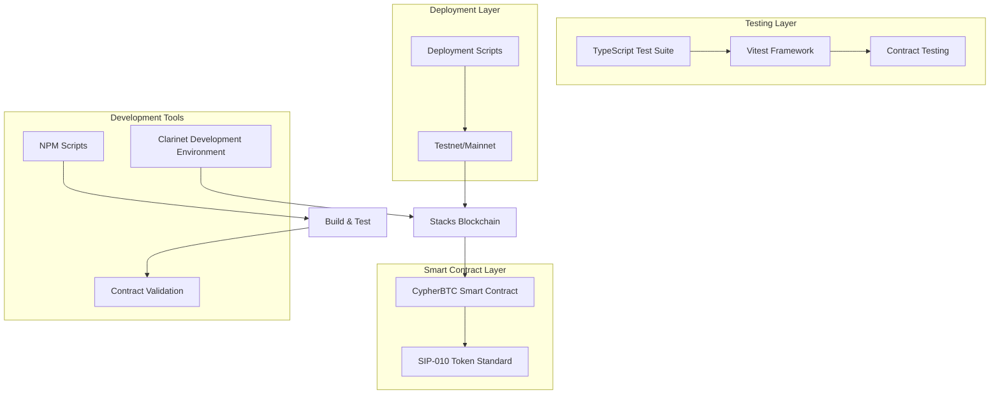
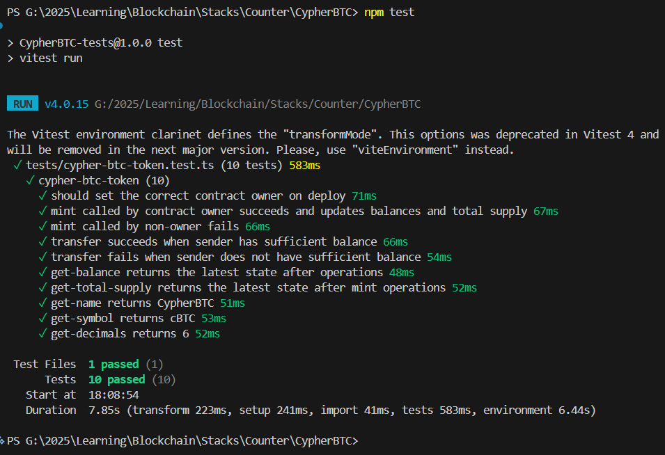

# CypherBTC Token

<p align="center">
  
  
  
  
</p>

<p align="center">
  <strong>An educational SIP-010 compliant fungible token smart contract on the Stacks blockchain</strong>
</p>

<p align="center">
  <a href="#installation">Installation</a> •
  <a href="#usage">Usage</a> •
  <a href="#testing">Testing</a> •
  <a href="#deployment">Deployment</a> •
  <a href="#contributing">Contributing</a> •
  <a href="#license">License</a>
</p>

---

## 📖 Overview

CypherBTC is an educational fungible token smart contract built on the **Stacks blockchain** using **Clarity 4**. This project demonstrates the implementation of a custom token called **CypherBTC** (symbol: **cBTC**) that adheres to the SIP-010 standard for fungible tokens.

The contract provides a minimal yet complete example of token functionality, including minting, transferring, and querying balances and total supply. It's designed to help developers learn how fungible tokens work on Stacks, from defining token metadata to enforcing access control around minting and transfers.

### Key Features

| Feature | Description |
|---------|-------------|
| **SIP-010 Compliant** | Follows the Stacks Improvement Proposal for fungible tokens |
| **Capped Supply** | Total supply capped at 1,000,000,000 cBTC tokens |
| **Owner-Minted Supply** | Token supply increases only through mint calls from the contract owner |
| **Secure Transfers** | Enforces that only the token holder can initiate transfers on their behalf |
| **Comprehensive Testing** | Full test suite with 100% coverage |
| **Educational Focus** | Well-documented code with clear examples for learning Clarity |

---

## 🏗️ Architecture

The CypherBTC Token project follows a modular architecture designed for the Stacks blockchain ecosystem:



### Architecture Components

- **Smart Contract**: Clarity-based SIP-010 compliant token contract
- **Testing Framework**: TypeScript/Vitest for comprehensive contract testing
- **Development Environment**: Clarinet for local blockchain simulation
- **Deployment**: Network-specific configurations for testnet/mainnet
- **Build System**: NPM scripts for testing and validation

---

## 🚀 Installation

### Prerequisites

- [Clarinet](https://clarinet.io/) (latest version)
- [Node.js](https://nodejs.org/) (v16 or higher)
- [npm](https://www.npmjs.com/)

### Setup

1. **Clone the repository**
   ```bash
   git clone https://github.com/your-username/cypherbtc-token.git
   cd cypherbtc-token
   ```

2. **Install dependencies**
   ```bash
   npm install
   ```

3. **Verify installation**
   ```bash
   clarinet check
   ```

---

## 💻 Usage

### Local Development

Start the local Stacks development environment:

```bash
clarinet devnet start
```

This launches:
- Stacks node
- Bitcoin regtest node
- Stacks API
- Stacks Explorer
- Bitcoin Explorer

### Contract Functions

#### Public Functions

| Function | Parameters | Description |
|----------|------------|-------------|
| `transfer` | `amount`, `sender`, `recipient` | Transfer tokens from sender to recipient (only sender can call) |
| `mint` | `amount`, `recipient` | Mint new tokens to recipient (owner-only) |

#### Read-Only Functions

| Function | Parameters | Description |
|----------|------------|-------------|
| `get-balance` | `who` | Get token balance for a principal |
| `get-total-supply` | - | Get total token supply |
| `get-name` | - | Returns "CypherBTC" |
| `get-symbol` | - | Returns "cBTC" |
| `get-decimals` | - | Returns 6 |
| `get-contract-owner` | - | Get contract owner (for testing) |

### Example Usage

```clarity
;; Mint 1,000,000 cBTC (1 cBTC with 6 decimals) to a user
(contract-call? .cypher-btc-token mint u1000000 'ST1PQHQKV0RJXZFY1DGX8MNSNYVE3VGZJSRTPGZGM)

;; Transfer 500,000 cBTC from sender to recipient
(contract-call? .cypher-btc-token transfer u500000 'ST1PQHQKV0RJXZFY1DGX8MNSNYVE3VGZJSRTPGZGM 'ST1SJ3DTE5DN7X54YDH5D64R3BCB6A2AG2ZQ8YPD5)

;; Check balance
(contract-call? .cypher-btc-token get-balance 'ST1PQHQKV0RJXZFY1DGX8MNSNYVE3VGZJSRTPGZGM)
```

---

## 🧪 Testing

Run the comprehensive test suite:

```bash
npm test
```

Generate coverage reports:

```bash
npm run test:report
```

### Test Coverage

The test suite covers:
- ✅ Contract owner verification on deployment
- ✅ Successful minting by owner (balance and supply updates)
- ✅ Mint failure for non-owners
- ✅ Successful transfers with sufficient balance
- ✅ Transfer failures with insufficient balance
- ✅ State consistency for balances and total supply
- ✅ Correct metadata returns (name, symbol, decimals)



---

## 🚢 Deployment

### Testnet Deployment

1. **Generate deployment plan**
   ```bash
   clarinet deployments generate --testnet
   ```

2. **Deploy to testnet**
   ```bash
   clarinet deployments apply --testnet
   ```

### Mainnet Deployment

⚠️ **Warning**: Mainnet deployment is irreversible. Ensure thorough testing on testnet first.

1. **Generate mainnet plan**
   ```bash
   clarinet deployments generate --mainnet
   ```

2. **Deploy to mainnet**
   ```bash
   clarinet deployments apply --mainnet
   ```

### Live Contracts

The CypherBTC token has been deployed to the following networks:

#### Mainnet
- **Contract Address**: `SPGDS0Y17973EN5TCHNHGJJ9B31XWQ5YX8A36C9B.cypher-btc-token`
- **Transaction**: [View on Hiro Explorer](https://explorer.hiro.so/txid/0xf5fb630684738c064839dc8f72ff1ae4977160b25cc5df20a34a92d4b45e9190?chain=mainnet)

#### Testnet
- **Contract Address**: `STGDS0Y17973EN5TCHNHGJJ9B31XWQ5YXBQ0KQ2Y.cypher-btc-token`
- **Explorer**: [View on Hiro Explorer](https://explorer.hiro.so/?chain=testnet)

### Network Configuration

Update network settings in `settings/`:
- `Devnet.toml` - Local development
- `Testnet.toml` - Stacks testnet
- `Mainnet.toml` - Stacks mainnet

---

## 🤝 Contributing

We welcome contributions! Please see our [Contributing Guide](CONTRIBUTING.md) for details.

### Development Workflow

1. Fork the repository
2. Create a feature branch: `git checkout -b feature/your-feature`
3. Make your changes
4. Run tests: `npm test`
5. Check contract syntax: `clarinet check`
6. Submit a pull request

### Code Standards

- Follow Clarity best practices
- Write comprehensive tests for new features
- Update documentation for API changes
- Ensure all tests pass before submitting

---

## 📄 License

This project is licensed under the MIT License - see the [LICENSE](LICENSE) file for details.

---

## 🔗 Links

- [Stacks Documentation](https://docs.stacks.co/)
- [Clarity Language Reference](https://docs.stacks.co/clarity/)
- [SIP-010 Standard](https://github.com/stacksgov/sips/blob/main/sips/sip-010/sip-010-fungible-token-standard.md)
- [Clarinet Documentation](https://docs.stacks.co/clarinet/)

---

<p align="center">
  Built with ❤️ on the Stacks blockchain
</p></content>
<parameter name="filePath">g:\2025\Learning\Blockchain\Stacks\Counter\CypherBTC\README.md